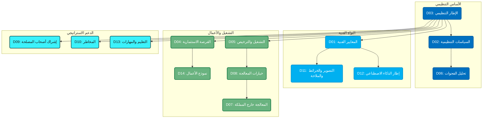

<div class="flex flex-col items-center justify-center h-full">
  <div class="flex items-center gap-4 mb-8">
    
  </div>

  <h1 class="text-4xl font-bold mb-4">الإطار التنظيمي للخرائط عالية الدقة</h1>
  <h2 class="text-3xl mb-2">لتقنيات المركبات ذاتية القيادة</h2>
  <h3 class="text-2xl mb-8">المملكة العربية السعودية</h3>

  <div class="text-lg mt-8">
    <p>الهيئة العامة للمساحة والمعلومات الجيومكانية (جيوسا)</p>
    <p class="mt-2">يناير 2026م</p>
  </div>
</div>

---
layout: default
---

# نظرة عامة على مجموعة الوثائق

## الوثائق التنظيمية الـ 14 للهيئة

| رقم | الوثيقة | الإصدار |
|-----|---------|---------|
| D01 | المعايير الفنية للخرائط عالية الدقة | v2.2 |
| D02 | السياسات التنظيمية للخرائط عالية الدقة | v2.3 |
| D03 | الإطار التنظيمي | v2.3 |
| D04 | الفرصة الاستثمارية | v2.2 |
| D05 | متطلبات التشغيل والترخيص | v1.3 |
| D06 | تحليل الفجوات | v1.5 |
| D07 | ضوابط معالجة البيانات خارج المملكة | v2.2 |

---
layout: default
---

# نظرة عامة على مجموعة الوثائق (تابع)

| رقم | الوثيقة | الإصدار |
|-----|---------|---------|
| D08 | خيارات معالجة البيانات | v2.2 |
| D09 | آلية إشراك أصحاب المصلحة | v2.2 |
| D10 | المخاطر | v2.2 |
| D11 | التصوير البانورامي والخرائط والملاحة | v2.2 |
| D12 | إطار تطور الذكاء الاصطناعي | v2.2 |
| D13 | التعليم وتنمية المهارات | v2.2 |
| D14 | نموذج الأعمال والتراخيص | v2.2 |

---
layout: full
class: diagram-slide
---

<div class="diagram-wrapper" dir="ltr">



</div>

---
layout: default
---

# شرح العلاقات بين الوثائق

| العلاقة | الوصف |
|---------|-------|
| **D03 ← D02** | الإطار التنظيمي يوفر الأساس للسياسات |
| **D03 ← D01** | الإطار يؤسس قاعدة المعايير الفنية |
| **D03 ← D05** | الإطار يحدد متطلبات الترخيص |
| **D01 ← D11** | المعايير تحدد متطلبات التصوير والخرائط |
| **D05 ← D07/D08** | متطلبات الترخيص تحكم خيارات المعالجة |
| **D03 ← D04** | الإطار يمكّن هيكل الفرصة الاستثمارية |
| **D04 ← D14** | الفرصة الاستثمارية ترتبط بنموذج الأعمال |

---
layout: default
class: separator
---

# D01 - المعايير الفنية

**الإصدار:** 2.2

**الغرض:** وضع معايير فنية شاملة تحكم دورة الحياة الكاملة للخرائط عالية الدقة

<v-clicks>

- معايير إنشاء الخرائط وجمع البيانات
- متطلبات نمذجة البيانات والتحقق منها
- إجراءات ضمان الجودة والتحديث
- معايير التوزيع والتوافقية
- مواصفات التكامل مع المركبات

</v-clicks>

---
layout: default
---

# D01 - المتطلبات الفنية

### معايير الإنشاء

<v-clicks>

- **نموذج البيانات:** ISO 20524 (GDF 5.1)
- **الصيغ:** NDS، ASAM OpenDRIVE، OGC CityGML
- **النظام المرجعي:** النظام المرجعي المكاني الوطني (SANSRS)
- **الدقة:** دون السنتيمتر، تفاصيل على مستوى المسار

</v-clicks>

### معايير السلامة

<v-clicks>

- **السلامة الوظيفية:** ISO 26262
- **سلامة الوظيفة المقصودة:** ISO/PAS 21448
- **الأمن السيبراني:** ISO/SAE 21434
- **اللوائح:** UNECE R155، R156

</v-clicks>

---
layout: default
class: separator
---

# D02 - السياسات التنظيمية

**الإصدار:** 2.3

**الغرض:** دليل مرجعي يجمع إطار الوثائق التنظيمية الصادرة عن الهيئة

<v-clicks>

- فهرس جميع الوثائق التنظيمية
- تصنيف أنواع الوثائق
- نطاق التطبيق لكل فئة
- دليل مرجعي لأصحاب المصلحة

</v-clicks>

---
layout: default
---

# D02 - فئات الوثائق التنظيمية

<v-clicks>

### 1. الأنظمة واللوائح
- الإطار التنظيمي العام للخرائط عالية الدقة

### 2. السياسات
- تصنيف البيانات | ترخيص البيانات | تسعير البيانات | مشاركة البيانات

### 3. المعايير
- المعايير الوطنية للبيانات الجيومكانية
- قاموس البيانات الجيومكانية الوطني

### 4. الأطر والإرشادات
- إطار حوكمة البيانات الجيومكانية الوطنية

</v-clicks>

---
layout: default
class: separator
---

# D03 - الإطار التنظيمي

**الإصدار:** 2.3

**الغرض:** الوثيقة الحاكمة الرئيسية للمبادئ والنطاق والأدوار

<v-clicks>

- المبادئ التنظيمية العامة
- تصنيف المركبات (SAE L1-L5)
- بيئات التشغيل
- هيكل الحوكمة متعدد الجهات
- التوافق مع رؤية 2030

</v-clicks>

---
layout: default
---

# D03 - هيكل الحوكمة

### مصفوفة المسؤوليات - الجهات الرئيسية

| الجهة | الدور |
|-------|-------|
| **الهيئة العامة للمساحة** | الجهة الرائدة للتنظيم الجيومكاني |
| **وزارة النقل** | لوائح المركبات والطرق |
| **الهيئة العامة للنقل** | تراخيص النقل |
| **الهيئة الوطنية للأمن السيبراني** | معايير الأمن |
| **سدايا** | حوكمة البيانات |
| **هيئة الاتصالات والفضاء والتقنية** | البنية التحتية |

---
layout: default
---

# D03 - المقارنة العالمية

| الدولة | النموذج |
|--------|---------|
| **المملكة العربية السعودية** | حوكمة مركزية مع تحرير مضبوط |
| **الصين** | رقابة حكومية صارمة |
| **الهند** | تحرير مفتوح |
| **الولايات المتحدة** | نموذج فيدرالي موزع |
| **ألمانيا** | إطار متوافق مع الاتحاد الأوروبي |

---
layout: default
class: separator
---

# D04 - الفرصة الاستثمارية

**الإصدار:** 2.2

**الغرض:** إطار لتطوير سوق الخرائط عالية الدقة في المملكة

<v-clicks>

- فئات المتقدمين (المصنعون والمنصات)
- نماذج الحوكمة والتشغيل
- إطار إدارة البيانات
- نموذج الأعمال مع الرسوم ومشاركة الإيرادات
- خطة التنفيذ ذات المراحل الخمس

</v-clicks>

---
layout: default
---

# D04 - مراحل التنفيذ

<v-clicks>

### المرحلة 1
استكمال الإطار التنظيمي

### المرحلة 2
مشاريع تجريبية في بيئات مضبوطة

### المرحلة 3
عمليات تجارية محدودة

### المرحلة 4
توسيع التغطية الجغرافية

### المرحلة 5
التشغيل الكامل في السوق

</v-clicks>

---
layout: default
class: separator
---

# D05 - متطلبات التشغيل والترخيص

**الإصدار:** 1.3

**الغرض:** الإطار التشغيلي العملي للجهات المنتجة للخرائط عالية الدقة

<v-clicks>

- شروط الكفاءة الفنية
- التمييز بين الترخيص والتصريح
- متطلبات الاختبار (6 فئات)
- إجراءات التحديث والصيانة
- الرقابة والامتثال

</v-clicks>

---
layout: default
---

# D05 - إطار الترخيص

### مستويات التفويض

| النوع | الغرض |
|-------|-------|
| **الترخيص** | تفويض عام لممارسة إنتاج الخرائط عالية الدقة |
| **التصريح** | تفويض خاص بمشروع لمناطق جغرافية محددة |

### فئات الاختبار

<v-clicks>

1. **اختبارات القبول:** التحقق من تمثيل الواقع الميداني
2. **اختبارات الجودة المكانية:** اتساق الطبقات وتحديد المواقع
3. **الاختبارات الميدانية:** مقارنة الخريطة بالطريق الفعلي
4. **اختبارات التكامل:** توافق أنظمة المركبة
5. **اختبارات المحاكاة:** التحقق في بيئة افتراضية
6. **إعادة التقييم الدوري:** التحقق بعد التحديثات

</v-clicks>

---
layout: default
class: separator
---

# D06 - تحليل الفجوات

**الإصدار:** 1.5

**الغرض:** تقييم القدرات الحالية مقابل المتطلبات اللازمة للخرائط عالية الدقة

<v-clicks>

- منهجية التقييم
- تقييم الوضع الراهن
- تحديد الفجوات عبر 5 أبعاد
- خارطة طريق بإجراءات ذات أولوية
- مراحل التنفيذ

</v-clicks>

---
layout: default
---

# D06 - الفجوات الحرجة

| مجال الفجوة | الوضع الحالي | الوضع المطلوب |
|-------------|--------------|---------------|
| معايير الخرائط | لا توجد معايير محددة | دقة دون السنتيمتر |
| الترخيص | مسح عام فقط | تصاريح خاصة |
| الرقابة | تركيز على الخرائط العامة | متطلبات الملاحة المتقدمة |
| البنية التحتية | اعتماد على السحابة الخارجية | قدرات معالجة محلية |

### جدول خارطة الطريق

| المدى | مجالات التركيز |
|-------|----------------|
| **قصير** | لوائح معالجة البيانات، الترخيص المتخصص |
| **متوسط** | المعايير الفنية، أطر الرقابة |
| **طويل** | مراكز معالجة مركزية، الصناعة المحلية |

---
layout: default
class: separator
---

# D07 - ضوابط المعالجة خارج المملكة

**الإصدار:** 2.2

**الغرض:** ضوابط صارمة للظروف الاستثنائية للمعالجة خارج المملكة

<v-clicks>

- الحفاظ على سيادة البيانات
- مبررات المعالجة الاستثنائية
- آلية الموافقة من 7 خطوات
- متطلبات الأمن والامتثال
- إجراءات الإنهاء وإعادة البيانات

</v-clicks>

---
layout: default
---

# D07 - آلية الموافقة

### المبادئ الأساسية

- المعالجة داخل المملكة هي **المتطلب الافتراضي**
- المعالجة الخارجية **استثنائية** وتتطلب مبرراً
- يجب **الحفاظ** على سيادة البيانات في جميع الأوقات

### الخطوات السبع

<v-clicks>

1. **تقديم الطلب:** مبرر تفصيلي ونطاق
2. **المراجعة الفنية:** تقييم القدرات
3. **التقييم الأمني:** تقييم المخاطر
4. **التشاور مع الجهات:** مراجعة متعددة الجهات
5. **الموافقة المشروطة:** الشروط والقيود
6. **المراقبة:** التحقق المستمر من الامتثال
7. **إعادة التقييم:** تقييم استمرار الضرورة

</v-clicks>

---
layout: default
class: separator
---

# D08 - خيارات معالجة البيانات

**الإصدار:** 2.2

**الغرض:** ثلاثة نماذج للمعالجة مع تحليل مقارن للمخاطر والامتثال

<v-clicks>

- ثلاثة خيارات للمعالجة
- 12 مبدأ عام
- مصفوفة إدارة المخاطر
- مقارنات فنية وأمنية
- إطار اتخاذ القرار

</v-clicks>

---
layout: default
---

# D08 - خيارات المعالجة الثلاثة

| الخيار | الوصف | مستوى المخاطر |
|--------|-------|---------------|
| **الخيار 1** | جميع المعالجة داخل المملكة | الأدنى |
| **الخيار 2** | عن بعد مع خطة توطين | متوسط |
| **الخيار 3** | خارج المملكة مع ضوابط صارمة | الأعلى |

### مصفوفة مقارنة المخاطر

| العامل | الخيار 1 | الخيار 2 | الخيار 3 |
|--------|----------|----------|----------|
| سيادة البيانات | كاملة | جزئية | مشروطة |
| مخاطر الأمن | منخفضة | متوسطة | عالية |
| عبء الامتثال | قياسي | مرتفع | أقصى |

---
layout: default
class: separator
---

# D09 - آلية إشراك أصحاب المصلحة

**الإصدار:** 2.2

**الغرض:** آليات إشراك أصحاب المصلحة خلال دورة حياة تطوير اللوائح

<v-clicks>

- سبع آليات للإشراك
- عمليات التشاور
- اللجان ومجموعات العمل المشتركة
- تقييم الأداء
- الشراكات بين القطاعين العام والخاص

</v-clicks>

---
layout: default
---

# D09 - آليات الإشراك السبع

<v-clicks>

1. **الاستشارات العامة** - نشر اللوائح المقترحة للتعليق
2. **اللجان المشتركة** - الجهات الحكومية ومزودي البيانات
3. **تحديثات الإطار** - مراجعة دورية بناءً على التطورات
4. **بيئات الاختبار** - بيئة تجريبية مضبوطة
5. **تقييم الأداء** - مؤشرات جودة البيانات
6. **التواصل العام** - تقارير دورية عن التقدم
7. **أطر التعاون** - شراكات استراتيجية ونقل التقنية

</v-clicks>

---
layout: default
class: separator
---

# D10 - المخاطر

**الإصدار:** 2.2

**الغرض:** تحديد المخاطر وتوفير استراتيجيات التخفيف

<v-clicks>

- ثلاث فئات رئيسية للمخاطر
- تقييم الأثر
- استراتيجيات التخفيف
- متطلبات الامتثال

</v-clicks>

---
layout: default
---

# D10 - فئات المخاطر

### 1. الاعتماد على مزود واحد
- **المخاطر:** الاعتماد على مزود سحابي واحد
- **التخفيف:** مزودين معتمدين، نماذج متعددة المزودين

### 2. استمرارية الأعمال
- **المخاطر:** الأعطال التقنية، انقطاع السحابة
- **التخفيف:** خطط استمرارية معتمدة، التعافي من الكوارث

### 3. أمن البيانات
- **المخاطر:** الاختراقات، الوصول غير المصرح به
- **التخفيف:** التشفير، إدارة الهوية، المراقبة المستمرة

---
layout: default
class: separator
---

# D11 - التصوير البانورامي والخرائط والملاحة

**الإصدار:** 2.2

**الغرض:** تعريف ثلاثة مجالات تقنية متكاملة ومتطلباتها التنظيمية

<v-clicks>

- تقنية التصوير البانورامي
- دور الخرائط عالية الدقة ومعاييرها
- تقنيات الملاحة
- متطلبات التكامل
- الإطار التنظيمي لكل منها

</v-clicks>

---
layout: default
---

# D11 - مكونات التقنية

### التصوير البانورامي
التقاط بصري بزاوية 360 درجة لبيئات الطرق

### الخرائط عالية الدقة
مراجع جيومكانية متقدمة بتفاصيل على مستوى المسار ودقة دون السنتيمتر

**المكونات:**
- هندسة الطريق (المسارات، الحدود، التقاطعات)
- البنية التحتية المرورية (اللافتات، الإشارات)
- المعلومات الدلالية (حدود السرعة، قيود الانعطاف)

### نموذج التكامل
```
التصوير البانورامي → إنتاج الخرائط → الملاحة → ردود فعل المركبة → التحديثات
```

---
layout: default
class: separator
---

# D12 - إطار تطور الذكاء الاصطناعي

**الإصدار:** 2.2

**الغرض:** أساس مفاهيمي لفهم تقنيات الذكاء الاصطناعي في الخرائط

<v-clicks>

- خمس مراحل لتطور الذكاء الاصطناعي
- خصائص التقنيات
- الصلة بالخرائط عالية الدقة
- نهج الأنظمة المتكاملة

</v-clicks>

---
layout: default
---

# D12 - مراحل تطور الذكاء الاصطناعي

<v-clicks>

### المرحلة 1: القائم على القواعد
أنظمة الخبراء، منطق "إذا-إذن"

### المرحلة 2: المبني على البيانات
التعلم الموجه، غير الموجه، التعزيزي

### المرحلة 3: التعلم العميق
الشبكات العصبية متعددة الطبقات

### المرحلة 4: الذكاء التوليدي
توليد المحتوى (نص، صور، كود)

### المرحلة 5: الأنظمة المتكاملة
أنظمة كاملة بمكونات متعددة ومصادر بيانات متنوعة

</v-clicks>

---
layout: default
class: separator
---

# D13 - التعليم وتنمية المهارات

**الإصدار:** 2.2

**الغرض:** إطار لتطوير القوى العاملة اللازمة لصناعة الخرائط عالية الدقة

<v-clicks>

- البرامج التعليمية
- مبادرات بناء القدرات
- الشراكات الاستراتيجية
- الشهادات والاعتمادات
- التحسين المستمر

</v-clicks>

---
layout: default
---

# D13 - مجالات بناء القدرات

| المجال | التركيز |
|--------|---------|
| **المهارات الفنية** | نظم المعلومات الجغرافية، المساحة، معالجة الليدار |
| **إدارة البيانات** | ضمان الجودة، معايير البيانات الوصفية |
| **الأمن السيبراني** | حماية البيانات، التحكم في الوصول |
| **الذكاء الاصطناعي** | تعلم الآلة لمعالجة الخرائط |
| **التنظيمي** | الامتثال، متطلبات الترخيص |

---
layout: default
class: separator
---

# D14 - نموذج الأعمال

**الإصدار:** 2.2

**الغرض:** الإطار التجاري لأنشطة الخرائط عالية الدقة

<v-clicks>

- هيكل التصاريح والتراخيص
- الشراكات الاستراتيجية
- نموذج مشاركة الإيرادات
- الاستدامة التجارية

</v-clicks>

---
layout: default
---

# D14 - هيكل التصاريح والتراخيص

| النوع | النطاق | أساس الرسوم |
|-------|--------|-------------|
| **ترخيص النشاط** | تفويض عام للممارسة | رسوم سنوية |
| **تصريح المشروع** | منطقة جغرافية محددة | نطاق المشروع |
| **الوصول للبيانات** | الوصول للبيانات الوطنية | قائم على الاستخدام |

### الشراكات الاستراتيجية

- **مع الشركات الوطنية:** بناء القدرات المحلية
- **مع المزودين الدوليين:** نقل التقنية
- **شراكات PPP:** الاستثمار في البنية التحتية

---
layout: default
class: separator
---

# المحاور الرئيسية عبر جميع الوثائق

| المحور | التنفيذ |
|--------|---------|
| **سيادة البيانات** | المعالجة داخل المملكة افتراضية |
| **المعايير الفنية** | التوافق مع ISO، OGC، SAE |
| **متطلبات السلامة** | ISO 26262، SOTIF، UNECE |
| **الأمن السيبراني** | إطار NCA، التشفير |
| **ضمان الجودة** | ISO 19157، بروتوكولات الاختبار |
| **التعاون** | الاستشارات العامة، الشراكات |
| **الجدوى التجارية** | إطار الاستثمار، مشاركة الإيرادات |

---
layout: cover
---

# الخاتمة

### نقاط القوة في الإطار

<v-clicks>

- تغطية شاملة من الاستراتيجية إلى العمليات
- حوكمة واضحة بأدوار محددة للجهات
- حماية قوية لسيادة البيانات
- التوافق مع المعايير الدولية
- آليات إشراك أصحاب المصلحة
- التركيز على تنمية المهارات

</v-clicks>

---
layout: cover
---

# الخطوات التالية

<v-clicks>

1. متابعة الوثائق المحددة بـ "قيد الإعداد"
2. المشاركة من خلال آليات أصحاب المصلحة
3. الاستعداد لمتطلبات الترخيص
4. الاستثمار في القدرات المحلية

</v-clicks>

<div class="mt-12 text-center">
  <p class="text-lg">الهيئة العامة للمساحة والمعلومات الجيومكانية</p>
  <p>يناير 2026م</p>
</div>
