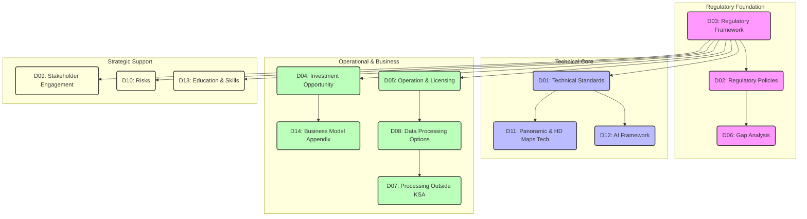

  

    
  

  <h1 class="text-4xl font-bold mb-4">Regulatory and Technical Framework</h1>
  <h2 class="text-3xl mb-2">Analysis for HD Maps</h2>
  <h3 class="text-2xl mb-8">for Autonomous Vehicles</h3>

  

    
General Authority for Survey and Geospatial Information

    
December 2025

  

---

layout: full
class: diagram-slide

---

---

## layout: default

# Technical Standards

**Overview:**
**Objective:** Establish the technical baseline for HD Map creation, verification, and usage in KSA.

<v-clicks>

- **Foundation:** Establishes the technical baseline for HD Map creation, verification, and usage in KSA.
- **Compliance:** Mandates compliance with international standards (ISO 14825, ISO 19157, OGC).
- **Safety:** Ensures interoperability and safety for Autonomous Vehicle (AV) systems.

</v-clicks>

---

## layout: default

# Technical Standards (Details)

**Technical Specifications:**

<v-clicks>

- **Data Models:** Adheres to GDF (ISO 14825/20524) and NDS.
- **Verification:** Requires ISO 19157 data quality standards (Completeness, Logical Consistency, Positional Accuracy).
- **Integration:** Supports ADASIS and ISO/TS 18750 for AV system integration.
- **Updates:** Mandates dynamic, real-time update mechanisms closer to the edge.

</v-clicks>

---

## layout: default

# Regulatory Policies

**Overview:**
**Objective:** Define the regulatory authority and document hierarchy.

<v-clicks>

- **Authority:** Compiles the regulatory authority and document hierarchy of GEOSA.
- **Scope:** Defines the scope of regulation: Production, Updating, Licensing, and Oversight.
- **Mandate:** Clarifies the legal basis for GEOSA's mandate over geospatial activities.

</v-clicks>

---

## layout: default

# Regulatory Policies (Details)

**Regulatory Framework Structure:**

<v-clicks>

- **Framework Hierarchy:** Regulations > Policies > Standards > Guidelines.
- **Scope:** Covers all "Geospatial Data" and "HD Maps" for AVs.
- **Compliance:** Links to Data Classification, Licensing, and Sharing Policies (NDCP, NDSP).
- **Sole Regulator:** Establishes GEOSA as the sole regulator for this sector in KSA.

</v-clicks>

---

## layout: default

# Regulatory Framework

**Overview:**
**Objective:** The Master Document establishing core principles and objectives.

<v-clicks>

- **Roles:** Defines responsibilities for GEOSA, Transport Ministries, and Private Sector.
- **Scope:** Applicability to SAE Level 3-5 vehicles and specific operational domains.
- **Core Principles:** Quality, Safety, Privacy, Data Sovereignty.

</v-clicks>

---

## layout: default

# Regulatory Framework (Details)

**Governance & Alignment:**

<v-clicks>

- **Governance Model:** Centralized oversight with private sector execution.
- **Key Principles:** Data Quality, Operational Safety, Privacy, Data Sovereignty.
- **RACI Matrix:** Defines Accountability vs Responsibility among entities.
- **International Alignment:** Compares Saudi model with China (Centralized), US (Decentralized), and India (Liberalized).

</v-clicks>

---

## layout: default

# Investment Opportunity

**Overview:**
**Objective:** Attract and regulate investment in the KSA HD Maps market.

<v-clicks>

- **Partnerships:** Defines "National Company" partnerships and revenue sharing models.
- **Classification:** Classifies applicants (OEMs vs. Technology Platforms).
- **Goal:** Foster a healthy and regulated market ecosystem.

</v-clicks>

---

## layout: default

# Investment Opportunity (Details)

**Market & Business Model:**

<v-clicks>

- **Market Phases:** Pilot Batch -> Controlled Expansion -> Maturity -> Stability.
- **Business Model:** Fee-based licenses + Revenue Sharing on data monetization.
- **Eligibility:** Strict technical and financial solvency requirements.
- **Exclusions:** Entities with security risks or lack of technical precedents.

</v-clicks>

---

## layout: default

# Operation & Licensing

**Overview:**
**Objective:** Operational "Rulebook" for practitioners.

<v-clicks>

- **Requirements:** Details requirements for obtaining and maintaining licenses.
- **Focus:** Focuses on provider competence (HR, Equipment, Cybersecurity).
- **Compliance:** Ensures only qualified entities operate in the critical geospatial domain.

</v-clicks>

---

## layout: default

# Operation & Licensing (Details)

**Licensing & Maintenance:**

<v-clicks>

- **License Types:** General Practice License vs. Project-Specific Permit.
- **Competence:** Requires certified staff and calibrated scanning equipment (LiDAR/GNSS).
- **Cybersecurity:** Mandatory compliance with NCA (ECC) standards.
- **Maintenance:** Strict SLAs for map updates and version control.

</v-clicks>

---

## layout: default

# Gap Analysis

**Overview:**
**Objective:** Assess current state vs. future needs.

<v-clicks>

- **Assessment:** Assesses the current state of KSA's geospatial ecosystem vs. future needs.
- **Gaps:** Identifies gaps in Regulation, Infrastructure, and Standards.
- **Roadmap:** Proposes a structured roadmap for closure.

</v-clicks>

---

## layout: default

# Gap Analysis (Details)

**Key Gaps & Roadmap:**

<v-clicks>

- **Gap 1 (Licensing):** Lack of specific "HD Map" license (Current licenses are too general).
- **Gap 2 (Infrastructure):** Insufficient local cloud/GPU infrastructure for heavy processing.
- **Gap 3 (Sovereignty):** Absence of data sovereignty rules for _processing_ (addressed in D07).
- **Roadmap:** Short-term (Regulations) -> Medium (Infrastructure) -> Long-term (Central Hub).

</v-clicks>

---

## layout: default

# Data Processing Outside KSA

**Overview:**
**Objective:** Rules for data sovereignty and external processing.

<v-clicks>

- **Strict Exception Code:** Processing outside KSA is an _exception_, not the rule.
- **Goal:** Protect National Data Sovereignty while allowing necessary technical operations.
- **Policy:** "Return and Destroy" policy for external data copies.

</v-clicks>

---

## layout: default

# Data Processing Outside KSA (Details)

**Controls & Conditions:**

<v-clicks>

- **Conditions:** Permitted only if local capability is absent (e.g., specialized HIL sims).
- **Controls:** Complete isolation of KSA data; No mixing with other datasets.
- **Termination:** Mandatory secure destruction of external copies and return of derived data.
- **Audit:** Right to audit external facilities physically or digitally.

</v-clicks>

---

## layout: default

# Data Processing Options

**Overview:**
**Objective:** Define valid architectural models for data handling.

<v-clicks>

- **Models:** Defines valid architectural models for data handling.
- **Terminology:** Local, Remote (Data Resident), and External.
- **Guidance:** Guides entities in selecting the right model based on data sensitivity.

</v-clicks>

---

## layout: default

# Data Processing Options (Details)

**Architecture Decision Matrix:**

<v-clicks>

- **Option 1 (Local):** End-to-end in KSA. (Standard for Sensitive Data).
- **Option 2 (Remote - Data Resident):** Processors sit abroad, but Data never leaves KSA (VDI/Remote Desktop).
- **Option 3 (External):** Data leaves KSA. (Requires D07 Exception).
- **Risk Matrix:** Compares risks of each model (Leakage, Lock-in, Compliance).

</v-clicks>

---

## layout: default

# Stakeholder Engagement

**Overview:**
**Objective:** Strategy for ecosystem alignment.

<v-clicks>

- **Strategy:** Strategy for keeping the ecosystem aligned.
- **Feedback:** Mechanisms for public consultation and private sector feedback.
- **Innovation:** Promotes "Regulatory Testing Environments" (Sandboxes).

</v-clicks>

---

## layout: default

# Stakeholder Engagement (Details)

**Engagement Mechanisms:**

<v-clicks>

- **Channels:** Public Consultation Platforms, Joint Committees, Workshops.
- **Feedback Loop:** Using pilot project results to refine regulations.
- **Partnerships:** Frameworks for PPPs and International collaboration.

</v-clicks>

---

## layout: default

# Risks

**Overview:**
**Objective:** High-level Risk Assessment.

<v-clicks>

- **Assessment:** High-level Risk Assessment for the National HD Map program.
- **Threats:** Identifies strategic threats to sustainability and security.

</v-clicks>

---

## layout: default

# Risks (Details)

**Strategic Risks:**

<v-clicks>

- **Vendor Lock-in:** Risk of relying on single cloud/tech providers (Mitigation: Multi-cloud/Class C providers).
- **Business Continuity:** Risk of outages affecting AV safety (Mitigation: Disaster Recovery standards).
- **Data Security:** Risk of sensitive geospatial data leakage (Mitigation: Encryption, NCA compliance).

</v-clicks>

---

## layout: default

# Panoramic & HD Maps Tech

**Overview:**
**Objective:** Technical definitions.

<v-clicks>

- **Definitions:** Technical appendix defining "What": Panoramic Imaging, HD Maps, Navigation.
- **Utility:** Explains utility: AVs, Smart Cities, Urban Planning.

</v-clicks>

---

## layout: default

# Panoramic & HD Maps Tech (Details)

**Tech Deep Dive:**

<v-clicks>

- **Panoramic:** Requirements for blurring (Privacy) and Feature Extraction (AI).
- **HD Maps:** Definition of layers (Lane models, Barriers, Signals).
- **Outputs:** Standard formats (GeoPackage, GeoJSON, KML).
- **Navigation:** GNSS/RTK integration requirements and National Spatial Reference alignment.

</v-clicks>

---

## layout: default

# AI Framework

**Overview:**
**Objective:** AI within the geospatial context.

<v-clicks>

- **Concepts:** Conceptual definitions of AI within the GEOSA context.
- **Evolution:** Traces evolution from Rule-Based to Generative AI.

</v-clicks>

---

## layout: default

# AI Framework (Details)

**AI Governance:**

<v-clicks>

- **Generative AI:** Recognizes GenAI's role in creating map content/code.
- **Systems View:** AI is not just models, but "Integrated Systems" (Data + Infra + Ops).
- **Training:** Defines the training lifecycle as a regulated process.

</v-clicks>

---

## layout: default

# Education & Skills

**Overview:**
**Objective:** Human Capital Development.

<v-clicks>

- **Talent:** Plan for Human Capital Development.
- **Pipeline:** Ensures a pipeline of qualified talent for the sector.

</v-clicks>

---

## layout: default

# Education & Skills (Details)

**Capacity Building:**

<v-clicks>

- **University Partnerships:** Curricula and Research Centers.
- **TVET:** Vocational training for field surveyors and operators.
- **Certification:** Mandatory professional certifications for key project roles.
- **Localization:** Knowledge transfer requirements from international partners to Saudis.

</v-clicks>

---

## layout: default

# Business Model Appendix

**Overview:**
**Objective:** Financial & Commercial Structure.

<v-clicks>

- **Mechanisms:** Supplements D04 with specific mechanism definitions.
- **Focus:** Focuses on the financial/commercial relationship structure.

</v-clicks>

---

## layout: default

# Business Model Appendix (Details)

**Revenue & Partnerships:**

<v-clicks>

- **Permissions:** Fees cover collection, production, and operation.
- **Revenue Sharing:** Model where GEOSA and National Companies share revenue from data monetization.
- **Strategic Partnerships:** Encourages identifying National Champions for operational delegation.

</v-clicks>
